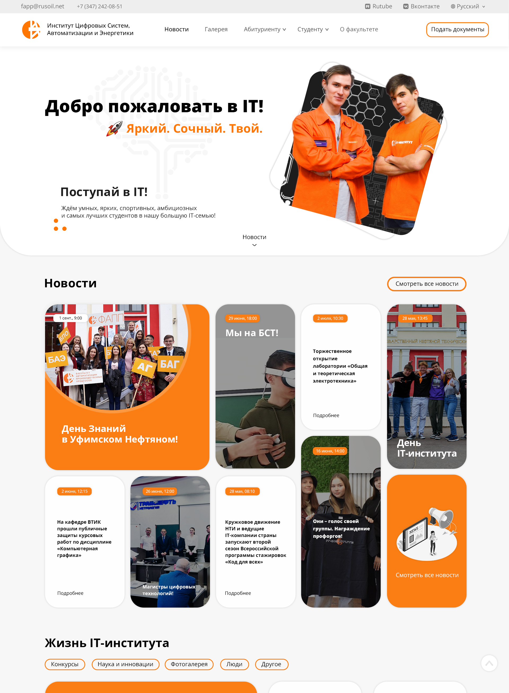
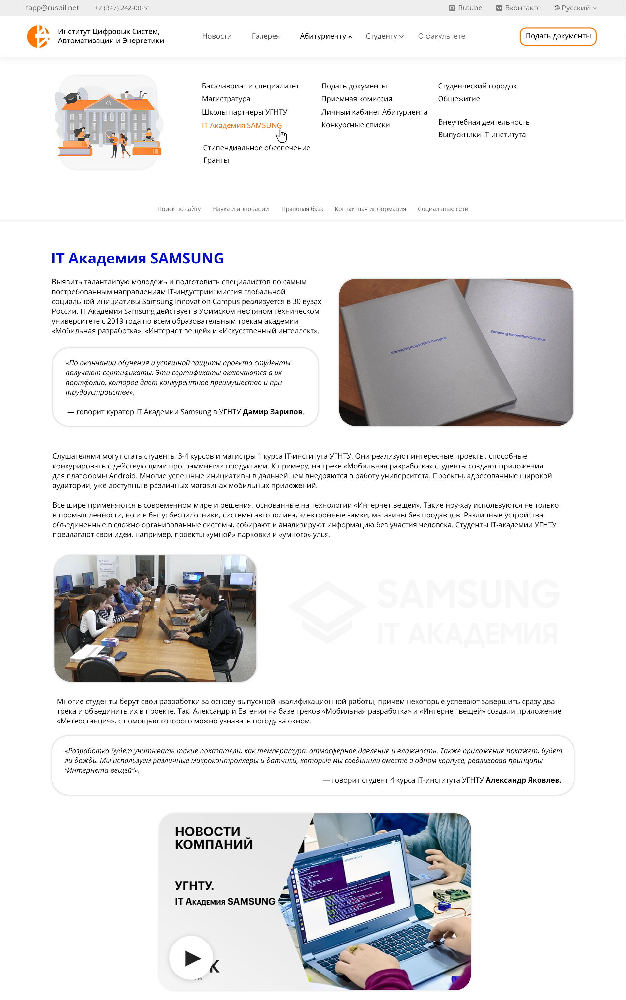

  
  

    <h2>IT-Институт Веб-Сайт</h2>
    
Этот проект представляет собой обновленную версию веб-сайта IT-Института, созданную с использованием современных технологий веб-разработки. Наша цель - предоставить пользователям удобный и информативный ресурс для получения актуальной информации о нашем институте, его образовательных программах, событиях и новостях.

  

**Что нового:**

1. **Современный дизайн:** Обновилен дизайн сайта, учитываются последние тренды веб-дизайна. Минималистический стиль, яркие акценты и адаптивный дизайн делают сайт приятным для глаза и удобным для использования на любом устройстве.

2. **Улучшенная навигация:** пересмотрена структура сайта, чтобы навигация стала более интуитивной и эффективной. Теперь пользователи легко найдут все необходимые разделы и информацию о нашем институте.

3. **Обновленные разделы:** Обновилена информация об образовательных программах, факультете, событиях и новостях. Каждая страница теперь содержит более полезную и актуальную информацию.

4. **Улучшенная производительность:** Мы оптимизировали код и ресурсы сайта, чтобы обеспечить максимальную производительность даже при медленном интернет-соединении. Теперь сайт загружается быстрее и работает более плавно.

**Использованные технологии:**

1. **CSS-фреймворк Bootstrap**
2. **HTML5 и CSS3**
3. **JavaScript (ES6+)**
4. **Webpack**
5. **Git и GitHub**

**Ссылки:**

- Демо: [Клик](https://true-lnz.github.io/web-IT-faculty/)
- Статья: [Разработка нового сайта IT-института](https://disk.yandex.ru/d/Chs2rnBlCtSiGw)
- Видео-презентация: [Смотреть](https://disk.yandex.ru/i/a6MxhfpL2y26zA) 

**Скриншоты:**

